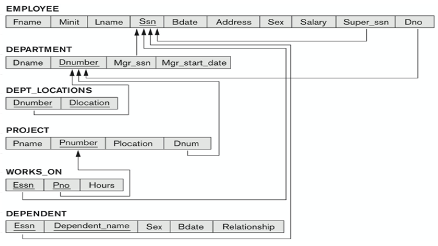

# Modeling and Storing data in SQL databases.





# MySQL Practice

### CREATE DATABASE company
```SQL
CREATE DATABASE test_company; -- create the database calls test_company
DROP DATABASE test_company; -- drop it
CREATE DATABASE company; -- create the database calls company
```

### CREATE TABLE EMPLOYEE
```SQL 
CREATE TABLE EMPLOYEE
(Fname VARCHAR(1 5) NOT NULL,
 Minit CHAR,
Lname VARCHAR(1 5) NOT NULL,
Ssn CHAR(9) NOT NULL,
Bdate DATE,
Address VARCHAR(30),
Sex CHAR,
Salary DECIMAL(1 0,2),
Super_ssn CHAR(9),
Dno INT NOT NULL,
PRIMARY KEY (Ssn) );
```

### CREATE TABLE company.DEPARTMENT
```SQL
CREATE TABLE company.DEPARTMENT
(Dname VARCHAR(15) NOT NULL, 
Dnumber INT NOT NULL,
Mgr_ssn CHAR(9) NOT NULL,
Mgr_start_date DATE,
PRIMARY KEY(Dnumber),
UNIQUE(Dname),
FOREIGN KEY(Mgr_ssn)REFERENCES company.EMPLOYEE(Ssn) );
```

### CREATE TABLE company.DEPT_LOCATIONS
```SQL
CREATE TABLE company.DEPT_LOCATIONS
( Dnumber INT NOT NULL,
Dlocation VARCHAR(15) NOT NULL,
PRIMARY KEY(Dnumber, Dlocation),
FOREIGN KEY(Dnumber) REFERENCES company.DEPARTMENT(Dnumber) );
```

### CREATE TABLE company.PROJECT
```SQL
CREATE TABLE company.PROJECT
( Pname VARCHAR(15) NOT NULL,
Pnumber INT NOT NULL,
Plocation VARCHAR(15),
Dnum INT NOT NULL,
PRIMARY KEY (Pnumber),
UNIQUE (Pname),
FOREIGN KEY(Dnum) REFERENCES company.DEPARTMENT(Dnumber) );
```

### CREATE TABLE company.WORKS_ON
```SQL
CREATE TABLE company.WORKS_ON
( Essn CHAR(9) NOT NULL,
Pno INT NOT NULL,
Hours DECIMAL(3,1) NOT NULL,
PRIMARY KEY(Essn, Pno),
FOREIGN KEY(Essn) REFERENCES EMPLOYEE(Ssn),
FOREIGN KEY (Pno) REFERENCES PROJECT(Pnumber) );
```

### CREATE TABLE company.DEPENDENT
```SQL
CREATE TABLE company.DEPENDENT
( Essn CHAR(9) NOT NULL,
Dependent_name VARCHAR(15) NOT NULL,
Sex CHAR,
Bdate DATE,
Relationship VARCHAR(8),
PRIMARY KEY(Essn, Dependent_name),
FOREIGN KEY(Essn) REFERENCES EMPLOYEE(Ssn) );
```

### Insert Values into company.employee
```SQL
insert into company.employee values ("John","B","Smith",123456789,"1970-06-20","Houston","M",30000,333445555,5);
insert into company.employee values ("Franklin","T","Wong",333445555,"1955-12-08","638 Voss, Houston TX","M",40000,888665555,5);
insert into company.employee values ("Alicia","J","Zelaya",999887777,"1968-01-19","3321 Castle, Spring TX","F",25000,987654321,4);
insert into company.employee values ("Jennifer","S","Wallace",987654321,"1941-06-20","291 Berry, Bellaire, TX","F",43000,888665555,4);
insert into company.employee values ("Ahmad","V","Jabbar",987987987,"1969-03-29","980 Dallas, Houston, TX","M",25000,987654321,4);
insert into company.employee values ("James","E","Borg",888665555,"1937-11-10","450 Stone, Houston, TX","M",55000,NULL,1);
insert into company.employee values ("Ramesh","K","Narayan",666884444,"1962-09-15","975 Fire Oak, Humble, TX","M",38000,333445555,5);
insert into company.employee values ("Joyce","A","English",453453453,"1972-07-31","5631 Rice, Houston, TX","F",25000,333445555,5);
```

### Insert Values into company.department
```SQL
insert into company.department values ("Research",5,333445555,"1988-05-22");
insert into company.department values ("Administration",4,987654321,"1995-01-01");
insert into company.department values ("Headquarters",1,888665555,"1981-06-19");
```

### Insert Values into company.dept_locations
```SQL
insert into company.dept_locations values(1,"Houston");
insert into company.dept_locations values(4,"Stafford");
insert into company.dept_locations values(5,"Bellaire");
insert into company.dept_locations values(5,"Sugarland");
insert into company.dept_locations values(5,"Houston");
```

### Insert Values into company.PROJECT
```SQL
insert into company.PROJECT values("ProductX",1,"Bellaire",5);
insert into company.PROJECT values("ProductY",2,"Sugarland",5);
insert into company.PROJECT values("ProductZ",3,"Houston",5);
insert into company.PROJECT values("Computerization",10,"Stafford",4);
insert into company.PROJECT values("Reorganization",20,"Houston",1);
insert into company.PROJECT values("Newbenefits",30,"Stafford",4);
```

### Insert Values into company.WORKS_ON
```SQL
insert into company.WORKS_ON values(123456789,1,32.5);
insert into company.WORKS_ON values(123456789,2,7.5);
insert into company.WORKS_ON values(666884444,3,40);
insert into company.WORKS_ON values(453453453,1,20);
insert into company.WORKS_ON values(453453453,2,20);
insert into company.WORKS_ON values(333445555,2,10);
insert into company.WORKS_ON values(333445555,3,10);
insert into company.WORKS_ON values(333445555,10,10);
insert into company.WORKS_ON values(333445555,20,10);
insert into company.WORKS_ON values(999887777,30,30);
insert into company.WORKS_ON values(999887777,10,10);
insert into company.WORKS_ON values(987987987,10,35);
insert into company.WORKS_ON values(987987987,30,5);
```

### ADD FORIGN KEY (DNO) TO EMPLOYEE
```SQL
ALTER TABLE company.EMPLOYEE ADD CONSTRAINT FOREIGN KEY (DNO) REFERENCES company.DEPARTMENT(DNUMBER);
```


## Queries: 

<details>
<summary> Q1.retrieve the Salary of every employee </summary>
  
```SQL
select salary from employee;
```
</details>

---

<details>
<summary> Q2.retrieve all distinct Salary values </summary>
  
```SQL
select distinct salary from employee;
```
</details>

---

<details>
<summary> Q3.retrieve the birth date and address of the employee(s) whose name is "John" </summary>
  
```SQL
select Bdate , address from employee where Fname = "john";
```
</details>

---

<details>
<summary> Q4.For each employee, retrieve the employee’s first and last name and the first and last name of his or her immediate supervisor </summary>
  
```SQL
select E.fname as "employee first name" , E.lname as "employee last name" , S.fname as "manager first name", S.lname as "manager last name"
from employee as E , employee as S
where E.Super_ssn = S.ssn;
```
</details>

 ---

<details>
<summary> Q5.retrieve all info of employees who work in department 5 </summary>
  
```SQL
select * from employee where Dno = 5;
```
</details>

---

<details>
<summary> Q6.retrieve all info of employees whose addresses contains Houston </summary>
  
```SQL
select * from employee where address like '%Houston%';
```
</details>

---

<details>
<summary> Q7.retrieve all info of employees whose salaries between 40000 and 30000 </summary>
  
```SQL
select * from employee where Salary between 30000 and 40000;
```
</details>

---

<details>
<summary> Q8.retrieve first name of all employees ordered alphabetically  </summary>
  
```SQL
select fname from employee order by Fname asc;
```
</details>

---

<details>
<summary> Q9.retrieve names of all employees who do not have supervisor </summary>
  
```SQL
select fname from employee where Super_ssn is null;

```
</details>

---

<details>
<summary> Q10.retrieve name of every employee whose Salary is greater than all the salaries of employees in department 5 </summary>
  
```SQL
select fname ,Salary
from employee 
where salary > All ( select salary 
                     from employee
                     where dno = 5
                          ) ;
```
</details>

---

<details>
<summary> Q11.max , min , avg , sum ,count </summary>
  
```SQL
SELECT SUM(Salary), MAX(Salary), MIN(Salary), AVG(Salary) , count(salary)
FROM	EMPLOYEE;
```
</details>

---

<details>
<summary> Q12.select the Essns of all employees who work the same (project, hours) combination on some project 
that employee ‘John Smith’ (whose Ssn = ‘123456789’) works on  </summary>
  
```SQL
select distinct Essn 
from works_on where (pno , hours) in ( select pno , hours
                         from works_on
                         where Essn = "123456789"
                         );
```
</details>

---


